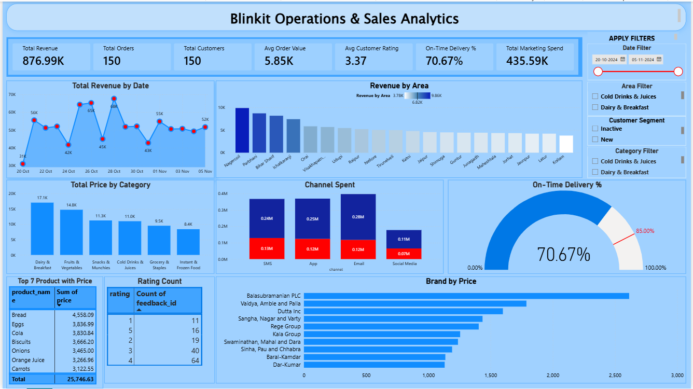

# 🛒 Blinkit Operations & Sales Analytics Dashboard

An enterprise-level **Power BI Data Analytics Project** designed to analyze quick-commerce operations, delivery SLA efficiency, customer satisfaction metrics, and marketing budget allocation for **Blinkit**.

---

## 📊 Executive Dashboard Preview

> 💡 **Interactive Exploration:** To interact with slicers, filters, and cross-highlighting, download `Blinkit_Analytics.pbix` from this repository and open it using **Power BI Desktop** (Free).

---

## 📋 Executive Summary & Key Performance Indicators (KPIs)

Quick-commerce platforms operate in high-velocity environments where delivery timelines directly impact customer retention. This dashboard consolidates operational and commercial metrics onto a single pane of glass:

| Metric Category | Key Metric | Value | Target / Benchmark | Status |
| :--- | :--- | :--- | :--- | :--- |
| **Commercials** | Total Revenue | **$876.99K** | $800.00K | 🟢 Exceeding |
| **Commercials** | Total Orders | **150** | — | ⚪ Baseline |
| **Commercials** | Average Order Value (AOV) | **$5.85K** | $5.00K | 🟢 Exceeding |
| **Operations** | On-Time Delivery Rate | **70.67%** | **85.00%** | 🔴 Critical Gap |
| **Customer Experience**| Avg Customer Rating | **3.37 / 5.0** | 4.20 / 5.0 | 🟡 Needs Improvement |
| **Marketing** | Total Marketing Spend | **$435.59K** | — | ⚪ Baseline |

---

## 🔍 In-Depth Data & Business Analysis

### 1. 🚚 Operations & Delivery SLA Performance
* **The Problem:** The current **On-Time Delivery Rate is 70.67%**, missing the corporate target of **85.00%** by **14.33%**.
* **Operational Impact:** Low delivery speeds strongly correlate with the average customer rating of **3.37 / 5.0**. The rating distribution reveals **11 one-star ratings** and **19 two-star ratings**, pointing directly to late order arrivals and fulfillment center latency.

### 2. 📦 Product Category & Top Revenue Drivers
* **Category Breakdown:** **Dairy & Breakfast ($17.1K)** and **Fruits & Vegetables ($14.8K)** dominate sales volume, proving that daily essentials are the main driver for order volume.
* **Top Individual Products:**
  1. **Bread:** `$4,558.09`
  2. **Eggs:** `$3,836.99`
  3. **Cola:** `$3,830.84`
  4. **Biscuits:** `$3,666.20`
  5. **Onions:** `$3,465.00`

### 3. 📢 Marketing Channel Budget & Efficiency
* **Channel Distribution:** Total marketing spend across channels stands at **$435.59K**.
  * **Email Marketing:** `$0.28M` (Largest budget allocation)
  * **Mobile App Engagement:** `$0.25M`
  * **SMS Campaigns:** `$0.24M`
  * **Social Media Ads:** `$0.11M`

---

## 🏗️ Data Architecture & Pipeline
